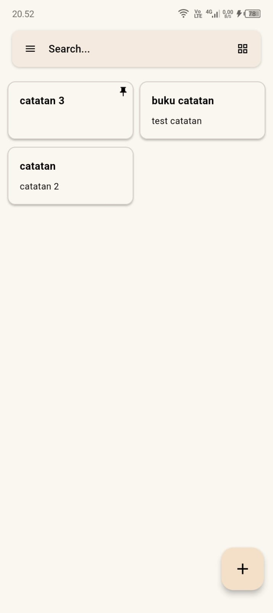
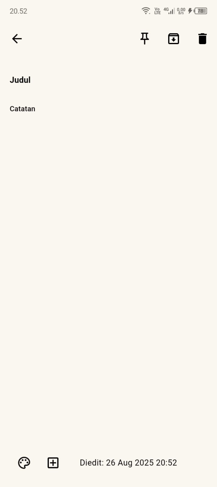
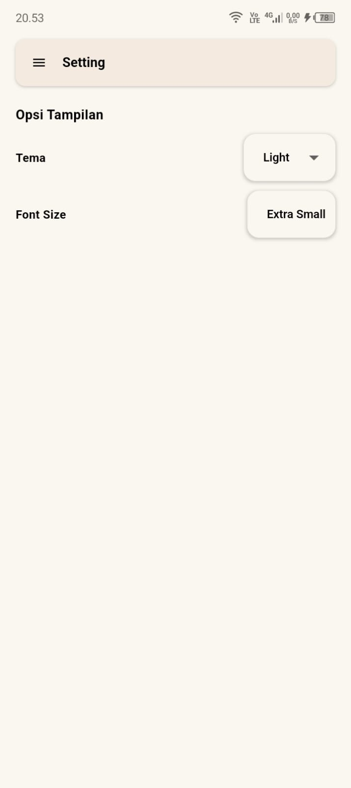

<h1 align="center">Tulisan Awak (Tuwak)</h1>

<p align="center">
  
</p>

## 📌 Tentang Aplikasi
Tulisan Awak adalah aplikasi catatan yang serbaguna yang dikembangkan menggunakan Flutter. Aplikasi ini memungkinkan pengguna untuk dengan mudah membuat, mengorganisir, dan mengelola catatan mereka, menjadikannya alat yang penting bagi siswa, profesional, dan siapa pun yang suka mencatat pemikiran mereka.

🎥 **Demo YouTube:** [Tonton di sini](https://youtube.com/shorts/XZbe4Kz67lI?si=SMFb5ZyrHgwAcepI)  

## 🚀 Fitur Utama
- 📝 **Buat & Edit Catatan** – tambah judul, isi catatan, dan ubah kapan saja.  
- 📌 **Pin Catatan** – sematkan catatan penting agar mudah ditemukan.  
- 🗂️ **Arsipkan Catatan** – rapikan catatan lama tanpa menghapus.  
- 🔍 **Pencarian Catatan** – temukan catatan lewat judul atau isi.  
- 🎨 **Ganti Background** – pilih warna catatan sesuai selera.  
- 🖼️ **Insert Gambar** – tambahkan gambar langsung ke catatan.  
- 📄 **Ekspor ke PDF** – simpan catatan ke format PDF.  
- 🌗 **Tema Gelap/Terang** – ikuti preferensi sistem atau pilih manual.  
- 💾 **Penyimpanan Lokal** – data tetap aman meskipun aplikasi ditutup.  

## 📷 Screenshots

<p align="center">
  
  
  
</p>

## Getting Started

## 🛠️ Getting Started
Untuk mencoba aplikasi ini:  
```bash
# Clone repositori
git clone <url-repo>
cd tulisan_awak_app

# Pasang dependensi
flutter pub get

# Jalankan aplikasi
flutter run
